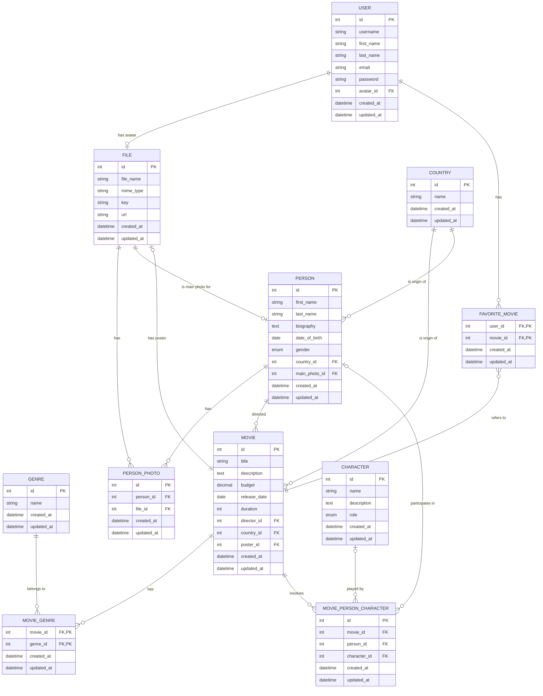

# Movie Database

## Overview

This project consists of a PostgreSQL database designed to store and manage information about movies, including details about actors, directors, genres, countries, and users. The database schema includes various tables to handle the relationships and attributes associated with movies and the people involved in their production.

## Directory Structure

```
/definition
  ├── create-database.sql
  └── populate-database.sql
/queries
  ├── 1_actors-total-budget.sql
  ├── 2_movie-actors-count.sql
  ├── 3_users-favourite-movies.sql
  ├── 4_directors-avg-budget.sql
  ├── 5_movies-by-criteria.sql
  └── 6_detailed-movie-info.sql
README.md
```

- **definition/create-database.sql**: Contains SQL statements to create all necessary tables and constraints.
- **definition/populate-database.sql**: Contains SQL statements to populate the tables with sample data.
- **queries/**: Contains individual SQL query files for retrieving specific information from the database.

## Database Schema

The database schema includes the following tables:

- `file`: Stores information about files (e.g., images, documents).
- `country`: Stores information about countries.
- `user_account`: Stores information about users.
- `genre`: Stores information about movie genres.
- `person`: Stores information about people (e.g., actors, directors).
- `person_photo`: Stores relationships between people and their photos.
- `movie`: Stores information about movies.
- `movie_genre`: Stores relationships between movies and genres.
- `character`: Stores information about characters in movies.
- `movie_person_character`: Stores relationships between movies, people, and characters.
- `favorite_movie`: Stores relationships between users and their favorite movies.

## ER-Diagram



## How to Set Up

1. **Create the Database**: Run the `definition/create-database.sql` script to create the database tables and constraints.
   ```sh
   psql -U your_username -d your_database -f definition/create-database.sql
   ```

2. **Populate the Database**: Run the `definition/populate-database.sql` script to insert sample data into the tables.
   ```sh
   psql -U your_username -d your_database -f definition/populate-database.sql
   ```

3. **Run Queries**: Use the `queries/1_actors-total-budget.sql` file to run predefined queries against the database.
   ```sh
   psql -U your_username -d your_database -f queries/1_actors-total-budget.sql
   ```
   
---

This README provides a basic overview and instructions for setting up and using the movie database. For more detailed information, please refer to the individual SQL files.
